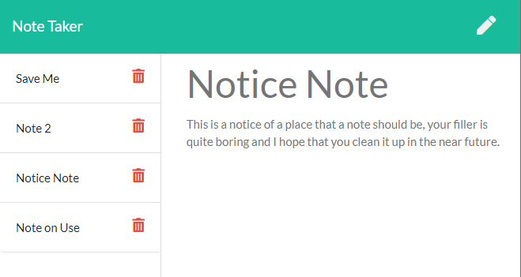

# parkers-note-taker

### Goal: create an API for existing webcode

[Link to repository](https://github.com/MorgansPlayGames/parkers-note-taker)

[Link to site](https://parkers-note-taker.herokuapp.com/notes)

1. [ Description. ](#description)
2. [ Installation ](#installation-instructions)
3. [ Usage Information ](#usage-information)
4. [ Contribution Guidelines ](#contribution-guidelines)
5. [ Licence ](#licence)
6. [ Questions ](#questions?)

## Description:
    Api to get, save, and delete files.
    Uses: Node, Express, and Path.

### Installation Instructions
    Download
    npm i  to install node dependancies
    node server.js  to start the server
    webpage is localhost:3000
 
### Usage Information
    Api to get notes from a json file
    Api to save a note to the json file
    Api to delete a note, then save the json
    Api call for for the two web pages.

### Contribution Guidelines
    Fork, update, and
    Submit your code to me!

### Licence 
    Copyright (c) 2020, Parker Morgan
    All rights reserved.
        
    This source code is licensed under the MIT-style license found in the
    LICENSE file in the root directory of this source tree.

### Questions?
    GitHub: MorgansPlayGames
    Email: jpmaster13@msn.com